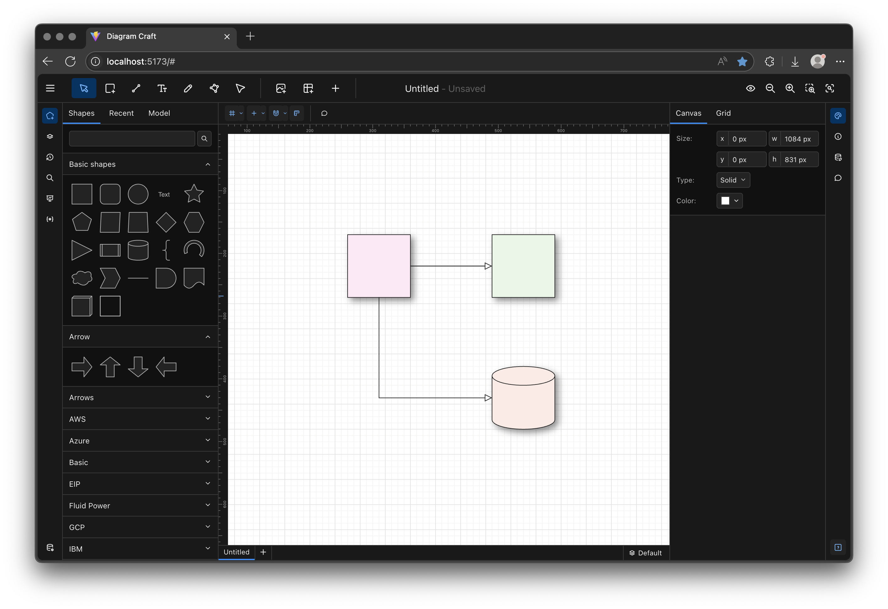

# Diagram Craft

Diagram Craft is an open-source interactive diagram editor, exploring advanced features such as multi-user
collaboration, model driven diagrams and many more.
Diagram Craft is built to use very few dependencies, making it easy to integrate
into your own projects.

Diagram Craft is currently in alpha, and is not yet ready for production use..



A demo is available at https://diagramcraft.github.io/diagram-craft/app/.

## Features

* **Multi-user collaboration**: Work simultaneously with team members on the same diagram with real-time updates,
  comments, and version control.

* **Text to diagram conversion**: Automatically generate diagrams from text descriptions and convert existing diagrams
  back to structured text for documentation and accessibility.

* **Advanced layer management**: Organize your diagrams with multiple layers, including specialized rule layers. Layers
  can be locked, hidden, or grouped for precise control over complex diagrams.

* **Nested tabs**: Structure complex projects with hierarchical tabs, allowing you to organize related diagrams together
  while maintaining a clean workspace.

* **Import from Drawio**: Import existing diagrams from Drawio, preserving layouts, styles, and connections.

* **Extensive alignment and snapping capabilities**: Create aligned diagrams with intelligent snapping to
  grids, and other elements.

* **Integrated data management**: Connect your diagrams to data sources, enabling dynamic updates and interactive
  elements. Create data-driven visualizations that automatically reflect changes in your underlying data.

* **Rich visual effects**: Apply effects such as reflections, glass surfaces, and hand-drawn styles to
  create visually appealing and distinctive diagrams.

* **Boolean operations**: Combine shapes using union, intersection, difference, and other boolean operations to create
  complex custom shapes with precision.

* **Comments and review system**: Add comments, feedback, and review notes directly to diagrams, facilitating team
  collaboration and iterative design processes.

## Build/Configuration Instructions

### Project Structure

Diagram Craft is organized as a monorepo using pnpm workspaces. The project is divided into multiple packages in the
`packages` directory:

**Core Model & Data:**

- `model`: Core data models (Diagram, DiagramNode, DiagramEdge, etc.)
- `geometry`: Geometric utilities and mathematical operations
- `utils`: Shared utility functions
- `collaboration`: CRDT-based collaboration system for real-time editing

**Canvas:**

- `canvas`: Core canvas rendering engine with component system
- `canvas-app`: Application-specific canvas features and tools
- `canvas-react`: React integration for canvas components
- `canvas-nodes`: Built-in node type definitions
- `canvas-edges`: Built-in edge type definitions
- `canvas-drawio`: Drawio import functionality and shape definitions

**Application:**

- `main`: Main React application (UI, toolbars, panels)
- `app-components`: Reusable UI components built on Radix UI
- `markdown`: Markdown parsing and rendering utilities

**Desktop:**

- `electron-app`: Electron application wrapper for desktop distribution
- `electron-client-api`: API layer for Electron-specific functionality

**Server:**

- `server-main`: Server-side code for collaboration features and REST data provider backend

### Setup and Installation

1. Ensure you have [pnpm](https://pnpm.io/) installed (version 9.3.0 or later)
2. Clone the repository
3. Install dependencies:
   ```bash
   pnpm install
   ```

### Development Scripts

- `pnpm client:dev`: Start the development server for the main client application
- `pnpm client:build`: Build the client application for production
- `pnpm client:preview`: Preview the production build
- `pnpm test`: Run tests
- `pnpm lint`: Run linting checks

### Server

```bash
pnpm install
cd packages/server/main
pnpm run dev
```

### Client

```bash
pnpm install
pnpm run client:dev
```
