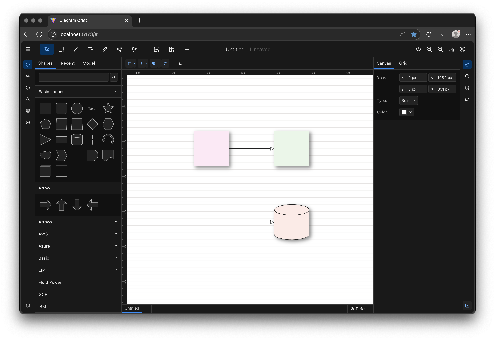
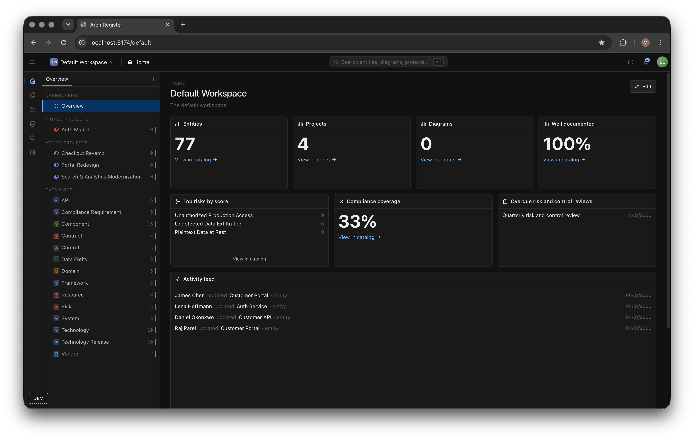

# Diagram Craft & Arch Register

This repository contains two connected tools for visualizing and managing Enterprise Architecture:

- **Diagram Craft** is an interactive editor for creating, arranging, styling, and sharing technical and visual
  diagrams.
- **Arch Register** is a collaborative Enterprise Architecture management platform for cataloguing systems,
  relationships, projects, documentation, and governance activity.

They can be used independently or together: Arch Register provides the structured architecture context, while Diagram
Craft provides the visual editing experience for associated diagrams.

## Diagram Craft

Diagram Craft is an open-source diagram editor that can run in the browser, as a desktop application, in a self-hosted
deployment, or embedded in another application. It is currently in alpha and is not yet ready for production use.



### Highlights

- **Rich diagram editing** — Create and style shapes, connectors, text, images, tables, and custom geometry on a large
  canvas.
- **Architecture notation support** — Use general-purpose shapes and stencil packages for C4, BPMN, UML, data
  modelling, ArchiMate, and other specialized diagrams, with optional Draw.io-backed and vendor icon libraries.
- **Organization and presentation** — Manage layers, groups, containers, nested diagram tabs, metadata, links, and
  guided stories for presenting a document.
- **Editing assistance** — Use alignment, distribution, snapping, guides, rulers, automatic layouts, boolean geometry,
  undo/redo, and a command palette to work efficiently.
- **Data-aware diagrams** — Attach local or external records to elements, display field values, query diagram content,
  and define rules that change appearance, visibility, or actions.
- **Collaboration and review** — Edit diagrams together in real time when collaboration services are configured, with
  participant awareness, comments, and working history.
- **Text and file workflows** — Edit diagrams through the text-to-diagram format, import Draw.io files, and export to
  PNG or SVG. Native JSON, `.dcd`, and embedded Diagram Craft SVG formats preserve editable structure.
- **AI-assisted workflows** — Convert between supported diagram and text representations; AI assistant capabilities are
  experimental and provider-dependent.

Try the [Diagram Craft demo](https://diagramcraft.github.io/diagram-craft/app/) or read the
[Diagram Craft documentation](https://diagramcraft.github.io/diagram-craft/). The detailed capability inventory is in
the [Diagram Craft feature map](feature-maps/diagram-craft.md).

## Arch Register

Arch Register is a collaborative Enterprise Architecture tool for maintaining a structured system landscape. It gives
teams a workspace in which they can register services, APIs, databases, teams, and other architectural entities, then
connect them to the projects and documentation that explain how the landscape changes over time.



### Highlights

- **Configurable architecture model** — Define entity schemas, fields, lifecycle states, reusable templates, and typed
  relationships that match the organization’s architecture language.
- **Structured catalog and analysis** — Create and maintain entities with ownership, hierarchy, history, and related
  content, then explore them through table, cards, tree, graph, topology, radar, timeline, matrix, map, and other
  configurable views.
- **Projects and documentation** — Organize project files, Markdown pages, attachments, revisions, assessments,
  milestones, and diagrams within workspace, project, and entity contexts.
- **Visual architecture workflows** — Associate Diagram Craft diagrams with entities and projects, inspect diagram
  previews, and create or edit diagrams from the architecture context.
- **Governance and collaboration** — Coordinate planned changes, approvals, deprecation workflows, assessments,
  discussions, watches, notifications, and audit history.
- **Access control** — Manage workspace roles, teams, entity-level grants, project scope, and permission-aware access to
  architecture data.
- **Integration and automation** — Use the documented API and API tokens, CSV import/export, webhooks, MCP, recurring
  jobs, and configurable automation rules. AI-assisted workflows and external content providers are experimental.

See the [Arch Register package guide](arch-register-packages/README.md), the
[Arch Register documentation](https://diagramcraft.github.io/diagram-craft/arch-register/intro), and the
[Arch Register feature map](feature-maps/arch-register.md) for more detail.

## How the products work together

Arch Register is the structured catalog and collaboration space for architecture information. Diagram Craft is the
canvas for turning that information into diagrams and communicating it visually. Associated diagrams can live alongside
entities and projects, while Diagram Craft can also be used as a standalone editor for diagrams that are not managed by
Arch Register.

## Development

This is a pnpm workspace monorepo. Install dependencies from the repository root:

```bash
pnpm install
```

### Diagram Craft

Start the browser application:

```bash
pnpm client:dev
```

For the standalone REST data server, use a second terminal:

```bash
pnpm run -C packages/server-main dev
```

To start the Electron application instead:

```bash
pnpm electron:dev
```

### Arch Register

Start the API server and web client in separate terminals:

```bash
# Terminal 1 — API server (port 3010)
pnpm --filter @arch-register/server dev

# Terminal 2 — web client (port 5174)
pnpm --filter @arch-register/web dev
```

Server configuration is documented in [`arch-register-packages/server/.env.example`](arch-register-packages/server/.env.example).
The [Arch Register package guide](arch-register-packages/README.md) covers the package structure, database options, and
additional development workflows.

### Documentation site

Run the local documentation site with:

```bash
pnpm docs:dev
```

## Testing and checks

```bash
# Unit and integration tests across the workspace
pnpm test

# TypeScript checks
pnpm lint:tsc

# Arch Register API tests
pnpm --filter @arch-register/e2e test:api

# Arch Register UI end-to-end tests
pnpm --filter @arch-register/e2e test:ui
```

## Repository layout

- `packages/` — Diagram Craft model, geometry, canvas, stencils, collaboration, applications, and servers
- `arch-register-packages/` — Arch Register API contracts, server, web client, permissions, integrations, and tests
- `docs-site/` — Documentation for both products
- `feature-maps/` — Human-readable inventories of user-facing capabilities for Diagram Craft and Arch Register
