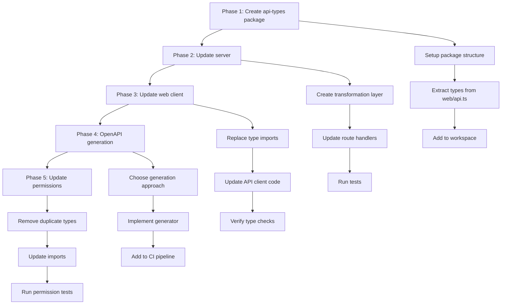

# API Type Sharing Strategy

## Current State Analysis

### Type Duplication Patterns

Currently, types are defined in three separate locations:

1. **Server Internal Types** (`server/src/types.ts`)
   - Database entity types (Entity, EntitySchema, Project, etc.)
   - Internal representations with Date objects
   - Used by database adapters and business logic

2. **Web Client API Types** (`web/src/api.ts`)
   - API response types with string dates
   - Prefixed metadata fields (`_uid`, `_schemaId`, etc.)
   - Client-specific helper types and constants

3. **OpenAPI Specification** (`server/openapi.yaml`)
   - Manually maintained schema definitions
   - Risk of drift from actual TypeScript types
   - Used for API documentation and validation

4. **Permissions Package** (`permissions/src/types.ts`)
   - Already demonstrates shared types pattern
   - Contains Entity, EntitySchema, and related types
   - Duplicates some types from server

### Problems with Current Approach

1. **Maintenance Burden**: Changes require updates in 3+ places
2. **Type Safety Gap**: No compile-time guarantee that API matches OpenAPI spec
3. **Inconsistency Risk**: Types can drift out of sync
4. **Developer Experience**: Confusion about which types to use where
5. **Duplication**: Same types defined multiple times with slight variations

## Proposed Solution

### Package Structure

Create a new shared package: `@arch-register/api-types`

```
arch-register-packages/
├── api-types/              # NEW: Shared API contract types
│   ├── package.json
│   ├── tsconfig.json
│   └── src/
│       ├── index.ts        # Main exports
│       ├── entities.ts     # Entity-related types
│       ├── schemas.ts      # Schema field types
│       ├── projects.ts     # Project-related types
│       ├── workspaces.ts   # Workspace types
│       ├── search.ts       # Search response types
│       ├── audit.ts        # Audit log types
│       └── common.ts       # Shared utilities
├── server/
├── web/
└── permissions/
```

### Type Categories

#### 1. API Contract Types (Shared)
Types that represent the API wire format - shared between server and client:

- `EntityRecord` - Full entity with data fields
- `EntitySummary` - Entity without custom data fields
- `EntitySchema` - Schema definition
- `SchemaField` variants (TextField, BooleanField, etc.)
- `Project`, `ProjectDetail`, `ProjectFile`
- `Workspace`
- `SearchResponse` and related types
- `AuditLogEntry` (API format)
- Request/response types for all endpoints

**Key characteristics:**
- Use string for dates (ISO 8601)
- Use API naming conventions (`_uid`, `_schemaId`, etc.)
- Include capability flags (`canView`, `canEdit`, etc.)
- Represent exactly what goes over the wire

#### 2. Server Internal Types (Server-only)
Types used internally by the server:

- Database entity types with Date objects
- Internal business logic types
- Database adapter interfaces
- Types that transform between DB and API formats

#### 3. Client-specific Types (Web-only)
Types specific to the web client:

- UI state types
- Form types
- Client-side helper constants (SCHEMA_COLORS, SCHEMA_ICONS)
- React component prop types

### Migration Strategy

#### Phase 1: Create API Types Package

1. **Setup package structure**
   ```json
   {
     "name": "@arch-register/api-types",
     "version": "0.1.0",
     "type": "module",
     "main": "./src/index.ts",
     "exports": {
       ".": "./src/index.ts",
       "./entities": "./src/entities.ts",
       "./schemas": "./src/schemas.ts",
       "./projects": "./src/projects.ts"
     }
   }
   ```

2. **Extract shared types from web/src/api.ts**
   - Move API response types to api-types package
   - Keep client-specific helpers in web package
   - Maintain exact type definitions initially

3. **Add api-types as dependency**
   ```json
   // server/package.json & web/package.json
   {
     "dependencies": {
       "@arch-register/api-types": "workspace:*"
     }
   }
   ```

#### Phase 2: Update Server

1. **Create transformation layer**
   ```typescript
   // server/src/api/transforms.ts
   import type { EntityRecord } from '@arch-register/api-types';
   import type { Entity } from '../types.js';
   
   export const toApiEntity = (entity: Entity): EntityRecord => ({
     _uid: entity.id,
     _workspace: entity.workspace,
     _schemaId: entity.schema_id,
     // ... transform Date to string, etc.
   });
   ```

2. **Update route handlers**
   - Import API types from `@arch-register/api-types`
   - Use transformation functions to convert internal types to API types
   - Keep internal types for database operations

3. **Maintain backward compatibility**
   - No breaking changes to API responses
   - Internal refactoring only

#### Phase 3: Update Web Client

1. **Replace local type definitions**
   ```typescript
   // web/src/api.ts
   export type {
     EntityRecord,
     EntitySummary,
     EntitySchema,
     Project,
     // ... etc
   } from '@arch-register/api-types';
   
   // Keep client-specific code
   export const SCHEMA_COLORS = [...];
   export const apiFetch = async <T>(...) => {...};
   ```

2. **Update imports throughout web package**
   - Replace local type imports with api-types imports
   - Verify type compatibility
   - Run type checks: `pnpm lint:tsc`

#### Phase 4: OpenAPI Schema Generation

Two approaches to consider:

**Option A: Generate OpenAPI from TypeScript**
- Use tools like `ts-to-zod` + `zod-to-openapi`
- Or `typescript-json-schema`
- Pros: Single source of truth (TypeScript)
- Cons: Generated schemas may need manual tweaking

**Option B: Validate OpenAPI against TypeScript**
- Keep manual OpenAPI spec
- Add validation step in CI
- Use `openapi-typescript` to generate types from spec
- Compare with api-types package
- Pros: Full control over OpenAPI spec
- Cons: Still requires manual maintenance

**Recommended: Option A with manual overrides**
```typescript
// api-types/scripts/generate-openapi.ts
import { generateSchema } from 'typescript-json-schema';
import { writeFileSync } from 'fs';

// Generate base schema from TypeScript
const schema = generateSchema('src/index.ts', '*');

// Apply manual overrides for documentation
const enhanced = enhanceWithDocs(schema);

writeFileSync('openapi-generated.yaml', enhanced);
```

#### Phase 5: Update Permissions Package

1. **Remove duplicate types**
   - Import Entity, EntitySchema from api-types
   - Keep permission-specific types (AuthorizationContext, etc.)

2. **Update dependencies**
   ```json
   {
     "dependencies": {
       "@arch-register/api-types": "workspace:*"
     }
   }
   ```

### Implementation Roadmap



### Detailed Type Mapping

#### Entity Types

```typescript
// @arch-register/api-types/src/entities.ts

export type EntityLink = {
  url: string;
  title: string;
  type?: string;
};

export type EntityCapabilities = {
  canView: boolean;
  canEdit: boolean;
  canDelete: boolean;
  canAdmin: boolean;
  canCreateChild: boolean;
};

export type EntitySummary = EntityCapabilities & {
  _uid: string;
  _workspace: string;
  _schemaId: string;
  _name: string;
  _slug: string;
  _namespace: string;
  _description: string;
  _owner: string | null;
  _lifecycle: string | null;
  _tags: string[];
  _links: EntityLink[];
  _visibilityMode: 'public' | 'restricted' | null;
};

export type EntityRecord = EntitySummary & {
  [key: string]: unknown; // Custom schema fields
};

// Request types
export type CreateEntityRequest = {
  _schemaId: string;
  _name?: string;
  _slug?: string;
  _namespace?: string;
  _description?: string;
  _owner?: string | null;
  _lifecycle?: string | null;
  _tags?: string[];
  _links?: EntityLink[];
  _visibilityMode?: 'public' | 'restricted' | null;
  [key: string]: unknown; // Custom fields
};

export type UpdateEntityRequest = CreateEntityRequest;
```

#### Schema Types

```typescript
// @arch-register/api-types/src/schemas.ts

export type TextField = {
  id: string;
  name: string;
  type: 'text' | 'longtext';
};

export type BooleanField = {
  id: string;
  name: string;
  type: 'boolean';
};

export type SelectField = {
  id: string;
  name: string;
  type: 'select';
  options: Array<{ value: string; label: string }>;
};

export type ReferenceField = {
  id: string;
  name: string;
  type: 'reference';
  schemaId: string;
  minCount: number;
  maxCount: number;
};

export type ContainmentField = {
  id: string;
  name: string;
  type: 'containment';
  schemaId: string;
  minCount: number;
  maxCount: number;
};

export type SchemaField = 
  | TextField 
  | BooleanField 
  | SelectField 
  | ReferenceField 
  | ContainmentField;

export type EntitySchema = {
  id: string;
  workspace: string;
  name: string;
  fields: SchemaField[];
  color: string | null;
  icon: string | null;
  entity_count: number;
  created_at: string; // ISO 8601
  updated_at: string; // ISO 8601
};

export type CreateSchemaRequest = {
  name: string;
  fields?: SchemaField[];
  color?: string | null;
  icon?: string | null;
};

export type UpdateSchemaRequest = CreateSchemaRequest;
```

#### Project Types

```typescript
// @arch-register/api-types/src/projects.ts

export type ProjectCapabilities = {
  canEdit: boolean;
  canDelete: boolean;
  canManageFiles: boolean;
};

export type Project = ProjectCapabilities & {
  id: string;
  workspace: string;
  name: string;
  description: string;
  owner: string | null;
  status: 'pinned' | 'active' | 'archived';
  file_count: number;
  created_at: string;
  updated_at: string;
};

export type ProjectFile = {
  id: string;
  path: string;
  name: string;
  size_bytes: number;
  created_at: string;
  updated_at: string;
};

export type FileTree = {
  folders: Array<{
    path: string;
    files: ProjectFile[];
  }>;
  rootFiles: ProjectFile[];
};

export type ProjectDetail = Project & {
  files: FileTree;
};

export type CreateProjectRequest = {
  name: string;
  description?: string;
  owner?: string | null;
  status?: 'pinned' | 'active' | 'archived';
};

export type UpdateProjectRequest = CreateProjectRequest;
```

### Benefits

1. **Single Source of Truth**: API contract defined once
2. **Type Safety**: Compile-time guarantees between client and server
3. **Reduced Duplication**: Types defined once, used everywhere
4. **Better DX**: Clear separation of concerns
5. **Easier Maintenance**: Changes in one place
6. **OpenAPI Sync**: Generated or validated from types
7. **Versioning**: Can version API types independently

### Potential Risks & Mitigations

#### Risk 1: Breaking Changes During Migration
**Mitigation**: 
- Migrate incrementally, one module at a time
- Maintain backward compatibility
- Use type aliases during transition
- Comprehensive testing at each phase

#### Risk 2: Build Complexity
**Mitigation**:
- Keep api-types package simple (no build step initially)
- Use TypeScript's native module resolution
- Leverage pnpm workspace features

#### Risk 3: Circular Dependencies
**Mitigation**:
- api-types should have no dependencies on server or web
- Clear dependency direction: server/web → api-types
- permissions can depend on api-types

#### Risk 4: OpenAPI Generation Limitations
**Mitigation**:
- Start with manual OpenAPI, add validation
- Gradually introduce generation for simple types
- Keep manual overrides for complex cases
- Document any manual adjustments needed

### Testing Strategy

1. **Type Tests**: Verify type compatibility
   ```typescript
   // api-types/src/__tests__/type-compatibility.test.ts
   import type { EntityRecord } from '../entities';
   
   // Ensure types are assignable
   const testEntity: EntityRecord = {
     _uid: 'test',
     // ... all required fields
   };
   ```

2. **Integration Tests**: Server → Client flow
   - Test API responses match expected types
   - Validate serialization/deserialization

3. **OpenAPI Validation**: 
   - Validate actual API responses against OpenAPI spec
   - Use tools like `openapi-validator`

### Success Criteria

- [ ] All API types defined in single package
- [ ] Server uses api-types for all API responses
- [ ] Web client imports types from api-types
- [ ] No type duplication between packages
- [ ] OpenAPI spec generated or validated from types
- [ ] All tests passing
- [ ] Documentation updated
- [ ] Zero breaking changes to existing API

### Next Steps

1. **Get Approval**: Review this plan with team
2. **Create api-types Package**: Start with Phase 1
3. **Pilot Migration**: Choose one module (e.g., entities) for initial migration
4. **Iterate**: Apply learnings to remaining modules
5. **Document**: Update developer documentation with new patterns

### Alternative Approaches Considered

#### Alternative 1: Keep Types in Server, Export for Client
**Pros**: Simpler, fewer packages
**Cons**: Creates dependency from web → server, wrong direction

#### Alternative 2: Generate Types from OpenAPI
**Pros**: OpenAPI as source of truth
**Cons**: TypeScript types become secondary, less flexible

#### Alternative 3: Use Zod Schemas
**Pros**: Runtime validation, single schema definition
**Cons**: More complex, runtime overhead, learning curve

**Decision**: Proceed with dedicated api-types package as it provides the best balance of type safety, maintainability, and developer experience.
