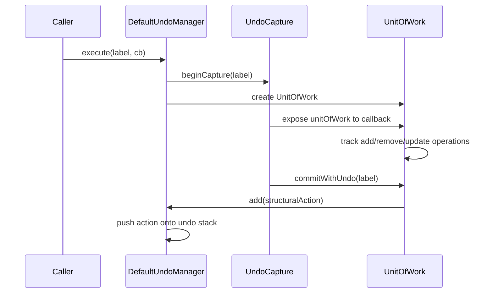
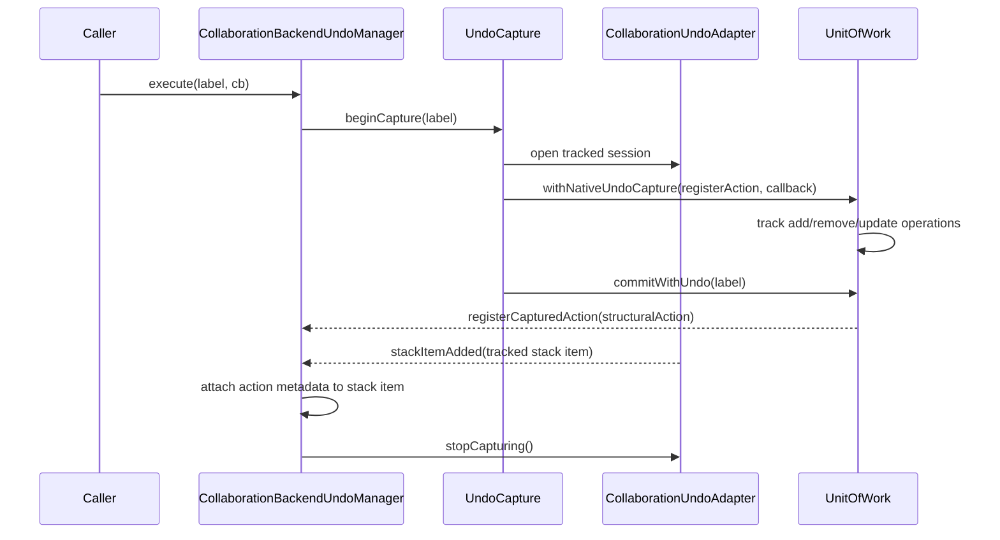
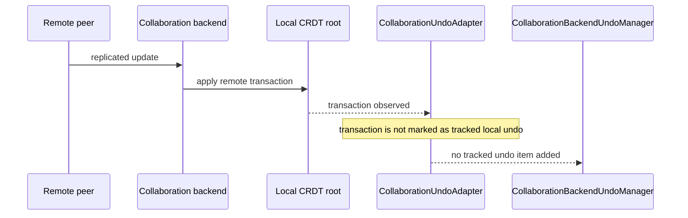

# UnitOfWork and UndoManager Flow

This note describes how undo works in `@diagram-craft/model`, and why the flow differs between the default stack-backed undo manager and the collaboration-backed undo manager.

## Main pieces

- `UnitOfWork`
  Tracks structural model changes (`add`, `remove`, `update`) for `UOWTrackable` objects and can build a structural `UndoableAction` from them.

- `UndoManager`
  The app-facing undo contract. Callers mostly interact with:
  - `execute(label, callback)`
  - `beginCapture(label)`
  - `addAndExecute(action)`
  - `undo()`
  - `redo()`
  - mark-related methods such as `setMark()` and `undoToMark()`

- `DefaultUndoManager`
  Keeps its own undo/redo stacks in model memory.

- `CollaborationBackendUndoManager`
  Delegates storage of undo history to a collaboration-specific `CollaborationUndoAdapter`.

- `CollaborationUndoAdapter`
  A generic adapter interface supplied by the active collaboration backend.
  The current Yjs implementation is `YjsCollaborationUndoAdapter`.

## Why `execute(...)` exists

`execute(label, callback)` defines the public execution boundary for one user-visible undo step.

That boundary is trivial for `DefaultUndoManager`, but it is essential for collaboration-backed undo.

- In the default case, structural undo is built after the mutation by `UnitOfWork.commitWithUndo(...)`.
- In the collaboration-backed case, the mutation must happen inside a backend-tracked transaction so the backend can decide that the change belongs on the local undo stack.

Because of that, callers no longer need to choose an undo implementation-specific path. They go through the active manager:

```ts
diagram.undoManager.execute(label, uow => {
  // perform the actual work in the provided UnitOfWork
})
```

## Why `withNativeUndoCapture(...)` exists

`UnitOfWork` already knows how to derive a structural `UndoableAction` from tracked operations. That logic is still useful in the collaboration-backed case, but we do not want to push that action into a second app-managed stack.

`UnitOfWork.withNativeUndoCapture(...)` is the bridge:

- it temporarily tells `UnitOfWork.commitWithUndo(...)` not to call `undoManager.add(action)`
- instead, it forwards the built structural action to a callback supplied by the collaboration-backed manager
- that manager stores the action as metadata on the backend-native undo stack item

So:

- `execute(...)` controls the public execution boundary
- `withNativeUndoCapture(...)` controls where the structural action built by `UnitOfWork` goes

## Default flow

This is the path used by `DefaultUndoManager`.

1. Caller invokes `diagram.undoManager.execute(label, callback)`.
2. `DefaultUndoManager.execute(...)` creates a capture and supplies its `UnitOfWork`.
3. The callback mutates the model using that `UnitOfWork`.
4. `capture.commit()` calls `UnitOfWork.commitWithUndo(...)`.
5. Because no native capture is active, `commitWithUndo(...)` calls `diagram.undoManager.add(action)`.
6. `DefaultUndoManager` stores the action in its in-memory undo stack.



## Collaboration-backed flow

This is the path used by `CollaborationBackendUndoManager`.

1. Caller invokes `diagram.undoManager.execute(label, callback)`.
2. `CollaborationBackendUndoManager.execute(...)` creates a capture.
3. That capture starts a tracked backend session and enters `UnitOfWork.withNativeUndoCapture(...)`.
4. The callback mutates the model using the capture's `UnitOfWork`.
5. `capture.commit()` calls `UnitOfWork.commitWithUndo(...)`.
6. Because native capture is active, `commitWithUndo(...)` does not call `undoManager.add(action)`.
7. Instead, it forwards the action to the manager's native-capture callback.
8. The backend creates a native undo stack item for the tracked transaction.
9. When the adapter emits `stackItemAdded`, the manager attaches the captured structural action as metadata on that stack item.
10. The manager calls `stopCapturing()` so the next user action becomes a separate backend undo item.



## Why `stopCapturing()` is necessary but not sufficient

`stopCapturing()` only splits adjacent backend-captured changes into separate history entries.

It does not:

- decide whether the mutation is tracked at all
- decide whether the change is local vs remote
- retroactively make an already-completed mutation undoable
- attach app-level action metadata to the backend stack item

For collaboration-backed undo, the important decision happens at mutation time: the mutation must run inside a backend-tracked transaction.

## Why collaboration-backed undo wraps the mutation

Collaboration backends such as Yjs decide whether a change belongs on the local undo stack when the transaction happens.

That means:

- you cannot mutate first and decide later that the mutation should be local undo history
- you cannot rely only on `UnitOfWork.commitWithUndo(...)` or `UndoManager.addAndExecute(...)` after the mutation
- you must wrap the actual mutation in the backend's tracked transaction boundary

This is the reason model code uses `undoManager.execute(...)` instead of directly assuming stack-backed undo.

## Remote updates

Remote updates should not become local undo history.

For collaboration-backed undo:

- the backend adapter tracks only explicitly tracked local transactions
- remote replicated changes do not use that tracked transaction marker
- therefore they do not enter the local undo stack

The model still applies remote changes through normal CRDT event handling, but those changes are intentionally outside local undo history.



## `addAndExecute(...)`

`addAndExecute(...)` is still supported for explicit command-style undo actions.

- `DefaultUndoManager`
  pushes the action onto its own stack and executes `redo()`

- `CollaborationBackendUndoManager`
  runs `redo()` inside a tracked backend transaction and treats the supplied action as the metadata for the backend-created undo stack item

This keeps command-style undo working while still letting collaboration-backed undo store history natively.

## Marks and stack-only behavior

The base `UndoManager` interface still exposes methods such as:

- `setMark()`
- `getToMark()`
- `undoToMark()`
- `clearRedo()`
- `combine()`

But not every implementation supports them with full stack semantics.

- `DefaultUndoManager`
  implements full in-memory stack behavior

- `CollaborationBackendUndoManager`
  supports only the safe subset needed by current callers:
  - `setMark()` stores undo depth
  - `undoToMark()` undoes back to that depth
  - `getToMark()` returns `[]`
  - `add()` is a no-op
  - `clearRedo()` is a no-op

That allows common call sites to stay uniform, while stack-inspection UI remains explicitly tied to `StackedUndoManager`.

## Practical rule of thumb

If you are writing new model code:

- use `undoManager.execute(...)` for structural model changes
- use `undoManager.addAndExecute(...)` only for explicit command-style undo actions
- do not assume every `UndoManager` has a mutable in-memory stack
- if a feature requires stack inspection or post-hoc stack rewriting, treat that as `StackedUndoManager`-specific behavior
